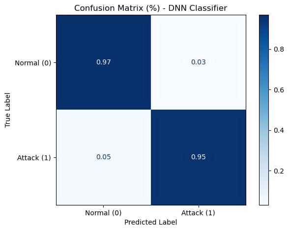
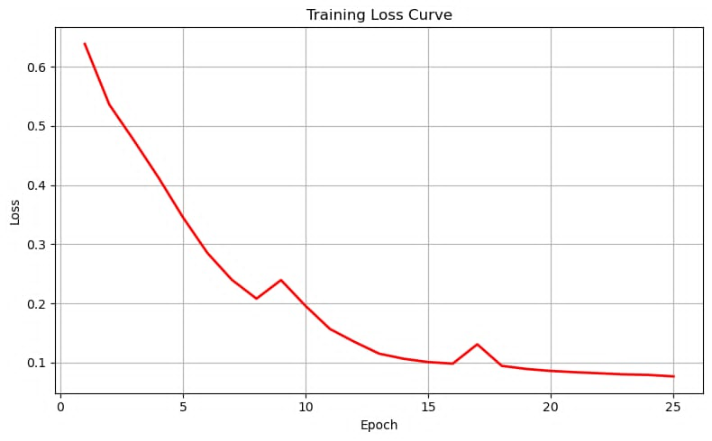
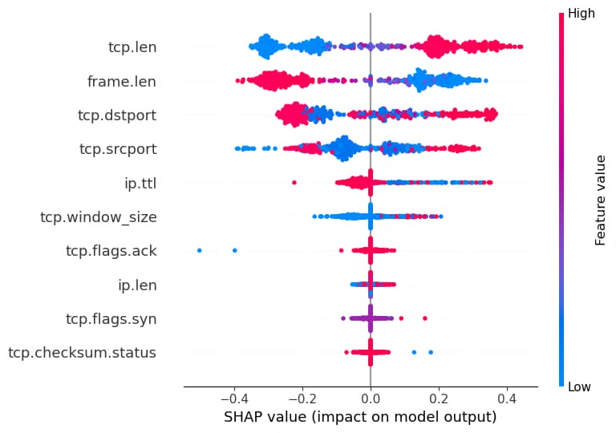

# IoT ARP Spoofing Detection using Deep Learning

A lightweight Deep Learning-based Intrusion Detection System (IDS) for detecting **ARP Spoofing attacks** in IoT networks using packet-level traffic analysis and SHAP explainability.

## Features

- Detects ARP Spoofing / MITM attacks
- Deep Neural Network (DNN) classifier
- SHAP Explainable AI visualization
- Packet-level traffic analysis
- High accuracy with low false positive rate

---

## Model

- Input: 21 network traffic features
- Architecture: `24 → 16 → 16 → 8 → 1`
- Activation: ReLU + Sigmoid
- Optimizer: Nadam

Important features:

- `frame.len`
- `ip.proto`
- `ip.len`
- `ip.ttl`
- `ip.flags`
- `ip.hdr_len`
- `arp`
- `tcp.flags.syn`
- `tcp.flags.ack`
- `tcp.flags.reset`
- `tcp.window_size`
- `icmp`
- `tcp.checksum.status`
- `tcp.dstport`
- `tcp.srcport`
- `tcp.flags`
- `tcp.len`
- `tcp.time_delta`
- `tcp.urgent_pointer`
- `udp.srcport`
- `udp.dstport`


## Results

| Metric | Score |
|---|---|
| Accuracy | 96.79% |
| Precision | 93.52% |
| Recall | 99.34% |
| F1-Score | 96.34% |


## Visualizations
- Confusion Matrix


- Training Loss Curve



- SHAP Summary Plot




## Installation

```bash
git clone https://github.com/MINHDANGab/iot-arp-spoofing-detection.git
cd iot-arp-spoofing-detection
pip install -r requirements.txt
```


## Usage

Train model:

```bash
python train.py
```

Evaluate model:

```bash
python evaluate.py
```


## Technologies

- Python
- Pytorch
- Scikit-learn
- SHAP
- Pandas
- NumPy

## Reference

This project was developed as a course project for the *Telecommunication Systems* course and is inspired by the research paper:

> Mohammed M. Alani et al.  
> "ARP-PROBE: An ARP spoofing detector for Internet of Things networks using explainable deep learning"  
> Internet of Things, 2023.
## Author

**Minh Dang**

GitHub: https://github.com/MINHDANGab